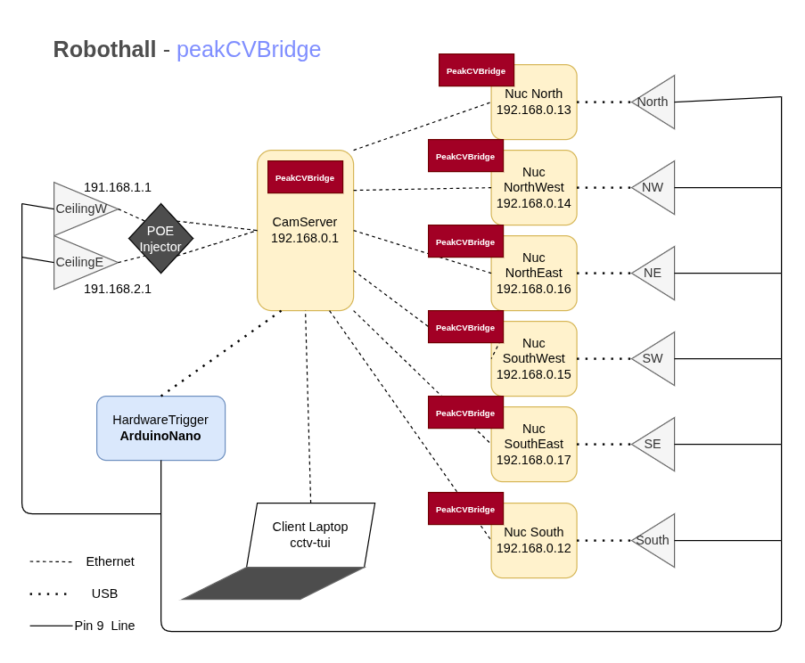
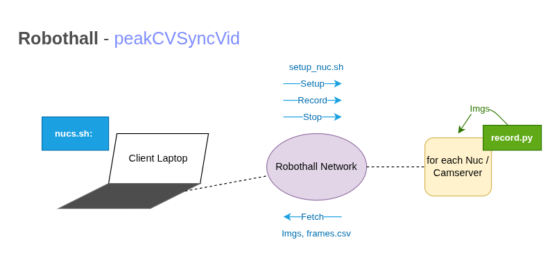

# PeakCVSyncVid
For generating synchronised videos / ordered frames of multiple cameras. Used for triangulation over time. 
This repository uses functionalities of [peak-cv-bridge](https://github.com/JMUWRobotics/peak-cv-bridge) and is dependet on this infrastructure (Hardware Trigger).
## Setting

## Problem
The hardware trigger only gurantees that all cameras start the exposure at the same. peakCVBridge does not provide saving and sending of the synced images to a connected client. `peakcvbridge-capture` has the argument `-t`to enable the trigger on line0.  It is possible to watch the image of the connected camera, by connecting with `ssh -X -i ~/.ssh/camera-nun-stud.key stud@192.168.0.[12,13,14,15,16,17]` and running:
```console
peakcvbridge-capture -t  
```
You can also stream all images from all cameras by (installing) and running `cctv-tui.py`on your laptop (connected to network) or on a server. But the frames we get are not highly synchronisated, which is crucial e.g. for triangulation.  
Additonally the images are not stored and can be exported.

## Functionality
PeakCVSyncVid uses `peakcvbridge` to access the IDS cameras easier (access with OpenCV) and the hardware trigger to capture in sync. The images are stored on each Nuc in format `frames/000000.png`. Same number = same trigge pulse = same time. Additonally a csv file (`frames.csv) is created to store the id of each frame, the host time and the path to the img. 



## Setup
In order not to have to run every single command on each Nuc independelty, you can find `nucs.sh`. The following dependencies are tried to install on the Nucs via `setup_nuc.sh`
### Dependencies
> - cv2
> - ids_peak  

You only need to run:
```console
./nucs.sh deploy
```
`setup_nucs.sh` for python venv generation, `record.py` will be copied to all nucs.  
Additionaly you need to activate the hardware trigger on the CamServer (which is connected to the arduino).  
`Hint`: We could not find the script. Therfore we copied the `set-frequency.sh` to the CamServer and set the baudrate to *115200* (also in the shell script it has to be changed). 
```console
ssh -p 700 cam@192.168.0.1
# copy code from peakcvbridge and change baudrate
chmod +x ~/set-frequency.sh
```
Aftward you have to start a screen to keep the trigger alive during your testing:
```console
screen -S trigger
~/set-frequency.sh <usb-device-name>
```
You now should get the message "Arduino Nano squarewave generator at your service.". Now you can type a frequency. It will be set. Do not change this value during recording. If you want to detach from this screen type:  Ctrl + A, D . You can test it by running (not in screen):
```console
peakcvbridge-capture -t -f 30
```
A window will be opened and one of the ceiling cameras shoulds be displayed.

## Usage
You can start the recording on all nucs by running aon your connected laptop:
```console
./nucs.sh record test 60 --exposure-ms 5
```
Additionally you can specify arguments:
- Folder name
- Duration
- Exposure time (in ms)

If you want to stop the recording earlier:
```console
./nucs.sh stop
```
Exporting images to laptop and syncing them:
```console
./nucs.sh fetch test
```
Delete generated data on nucs:
```console
./nucs.sh clean test
```
Afterwards you have fetched, you have a folder `recording/test` with folders `nucN, nucNW, nucNE, SW, SE, S`. You can now generate synced images to avoid 
```console
python3 sync_frames.py recordings/test
```

